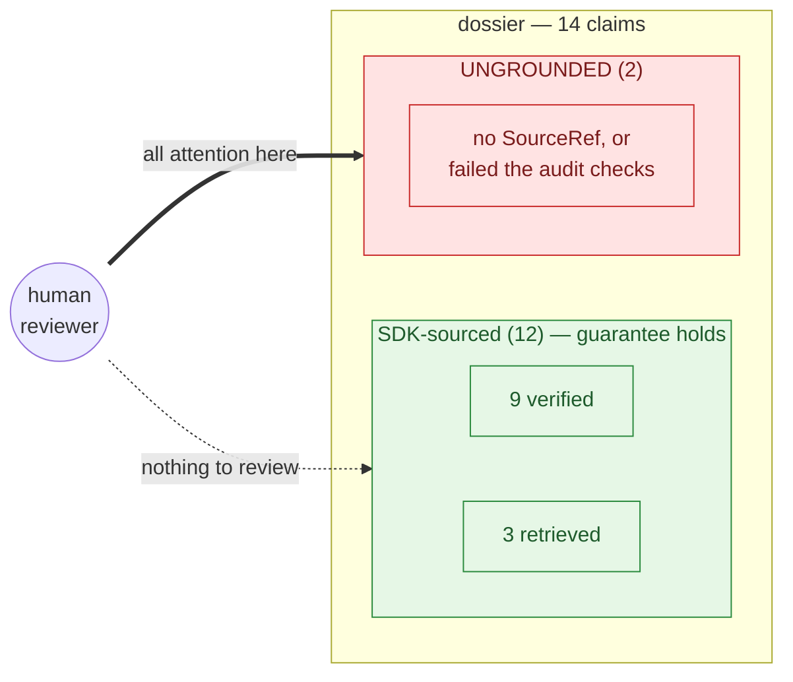
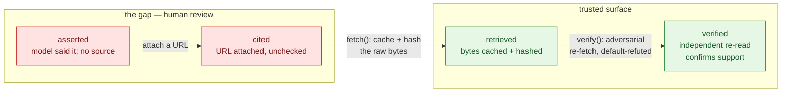
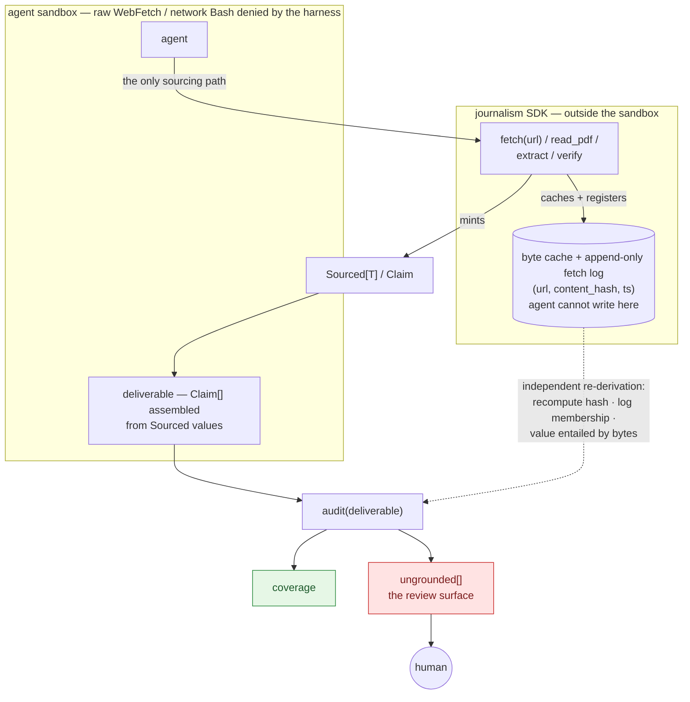
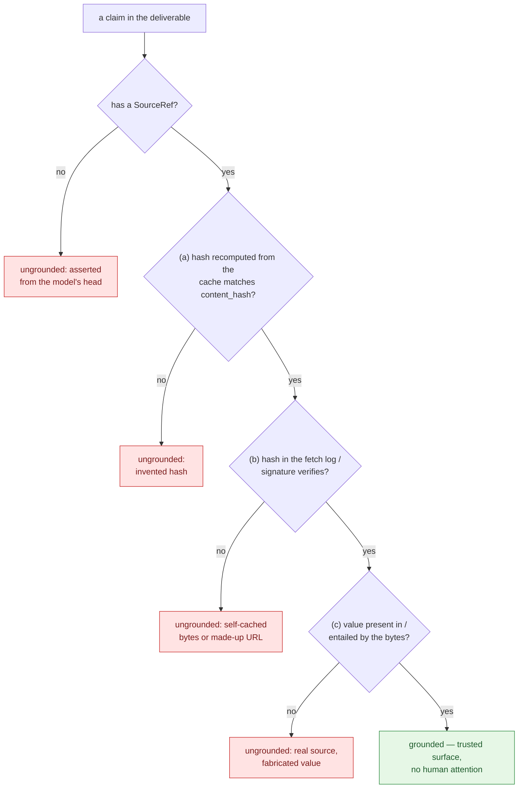

# Reviewability by coverage — `Sourced[T]` and the journalism SDK

*Design note. No code yet — this pins the principle so it can be reviewed before we build.*

## The inversion

The naive move is to log what the SDK did and have a human read the log. That spends
review attention on the **trusted** path. Wrong way round.

> The SDK exists to provide **guarantees**. Where it was used, the guarantee holds —
> there is nothing to review. The thing worth a human's attention is the **complement**:
> what the agent produced that the SDK did *not* guarantee.

So reviewability is a **coverage** problem, exactly like type coverage or test coverage:
you trust the typed/tested surface and your eyes go to the `any`s and the uncovered
branches. Here the "typed/tested surface" is *facts that came through the SDK*; the
review surface is *facts that didn't*.

The deliverable's review report should read:

```
dossier: 14 claims · 12 SDK-sourced · 9 verified · 2 UNGROUNDED  ← review these two
```

Not a ledger to admire — a **gap report** to scrutinize.



---

## `Sourced[T]` — what is this, exactly?

It is **not a new language, and not a DSL.** It's a plain Python *generic type* plus a
*discipline*. Concretely, roughly:

```python
@dataclass(frozen=True)
class SourceRef:
    url: str
    retrieved_at: str
    content_hash: str        # hash of the cached raw bytes (the "raw alongside the cooked")
    locator: str | None = None   # page / span / table id, for re-finding

@dataclass(frozen=True)
class Sourced(Generic[T]):
    value: T
    source: SourceRef
    grade: Grade             # see below
```

`Sourced[float]` is "a float that knows where it came from." A function that returns
`Sourced[float]` cannot, by its signature, hand back a bare number.

**Be honest about what the *type* buys and what it doesn't.** Python's type system is
gradual and unsound — a static checker (mypy/pyright) will flag a function that claims
`Sourced[float]` and returns a bare `float`, but:
- nothing stops code from dropping to `Any`, and
- an LLM emitting a **prose dossier** isn't running a type checker at all.

So the type alone is **necessary, not sufficient**. The teeth come from the *system*
around it (next section), not from the compiler. The type's real jobs are three:
1. **vocabulary** — a fact and its provenance are one inseparable object;
2. **runtime carrier** — the source + cached-bytes hash travel with every value;
3. **the unit the auditor measures** — an un-`Sourced` value in a deliverable is a
   *machine-detectable hole* instead of a silent one.

### Provenance has grades (sourced ≠ true)

A `SourceRef` being attached does not mean the source supports the claim. So `grade`
is a ladder, and the auditor reports the distribution:

| grade | meaning | review weight |
|---|---|---|
| `asserted` | model said it; no source | **always review** — this is fabrication risk |
| `cited` | a URL is attached | review (the URL may not say what's claimed) |
| `retrieved` | the source bytes are cached + hashed (reproducible) | low |
| `verified` | an independent check re-read the bytes and confirmed support | lowest |

`verify(claim)` (adversarial re-fetch, default-refuted) is what promotes `retrieved →
verified`. High-stakes claims should require `verified`; everything below `retrieved`
is the gap.



---

## How `Sourced[T]` interacts with the SDK

`Sourced[T]` is the **currency between the producer (SDK) and the checker (auditor).**
Three parts, and the guarantee is their *combination*:

1. **The SDK is the *issuing authority* — and the auditor doesn't trust the token, it
   re-checks it.** A `Sourced[T]` the agent constructs by hand is worthless
   self-attestation (see "The forgery hole" below). So the fetcher issues a `SourceRef`
   that is *checkable against records the agent can't write*: `fetch(url)` caches the
   raw bytes and registers `(url, content_hash, ts)` in an append-only fetch log (or
   signs the ref with a key the agent never sees). `extract`/`verify` only attach refs
   that already exist in that log.

2. **The harness makes the SDK the only *path*.** Run the agent with the raw escape
   hatches denied — no bare `WebFetch`/`Bash` network; the only fetch is the SDK's.
   (We've already used this exact lever: denying tools is how the extract LLM was made
   to stop free-roaming.) Then *off-SDK sourcing is structurally impossible.* The only
   way left to produce an unguaranteed fact is to assert it from the model's head — and
   that surfaces in (3) as an `asserted` value with no `SourceRef`.

3. **The auditor independently re-derives provenance — it never takes `Sourced` at face
   value.** `audit(deliverable) -> {coverage, ungrounded[]}` walks every claim and, for
   each: (a) recomputes the `content_hash` from the cache (catches invented hashes);
   (b) confirms that hash is in the fetcher's log / the ref's signature verifies
   (catches "I cached bytes myself / made up a URL"); (c) confirms the value is actually
   present in / entailed by the bytes (catches "real source, fabricated value"). Anything
   failing (a)–(c) — or any escape-hatch use — is `ungrounded`: the review queue.
   Coverage is the trust metric; `ungrounded` is where humans look.



The point in one line: **the SDK turns "source everything" from a convention the agent
should follow into a property the system can measure the absence of.**

### The forgery hole (why a constructible type isn't a guarantee)

`Sourced[T]` is just a Python object — an agent can write `Sourced(99, SourceRef(...))`
directly as a reward-hack, and a naive auditor that checks only "is this a `Sourced`?"
is reading the agent's own rubber stamp. So the guarantee is **not** "it's typed
`Sourced`" — it's the auditor's **independent re-derivation** above: a forged ref fails
the hash-recompute / log-membership / value-in-bytes checks. The agent may still
*construct* the object; it gains nothing.



The whole thing rests on one **trust boundary — minting must live outside the agent's
code-execution sandbox:**
- **Live-agent phase:** `fetch` is a *harness/MCP tool the agent calls*, with the cache,
  log, and signing key written harness-side. If the agent can run arbitrary Python
  in-process with the SDK it can grab the key and forge check (b) — so the minter must
  be isolated from agent code.
- **DAG phase:** the `python_transform` code *is reviewed before it runs*, so a
  hand-rolled `Sourced(99, …)` is caught in code review, not at runtime. Same guarantee,
  different enforcement (isolated tool vs. reviewed code).

This raises the *cost* of fabrication and makes it conspicuous; it is **not proof**.
Check (c)'s entailment for non-extractive claims is an LLM judgment — and the fabricating
model must not be its own verifier — so the human stays the backstop, now pointed only at
the small `ungrounded` / low-grade set.

---

## The general principle (beyond journalism) and the tie to the DAG

`Sourced[T]` generalizes to: **make provenance a property of a value's type, so that
the *lack* of provenance is detectable rather than silent.** Any domain where outputs
must be traceable (legal, medical, finance, audit) wants this.

It is the *scalar/agentic* twin of something this repo already does in the *tabular/
production* world:

| | exploratory phase (agent) | production phase (DAG) |
|---|---|---|
| unit | `Sourced[T]` / `Claim` | a row + its `source:` columns |
| guarantee maker | the SDK (only minter) | the runner (typed I/O, validation) |
| the gap | `ungrounded` claims from `audit()` | `llm_transform` output with empty `evidence_urls` |
| how the gap is handled | flagged for human review | demoted / `verify`'d / sent to `human_review_queue` |

Same discipline, two phases, one contract (provenance). And it closes the loop already
sketched: the SDK's typed operations map onto the node types, so an SDK session
distills into a DAG far more cleanly than a raw transcript does. Reviewability is then
**uniform across explore → compile → run → eval**, because every phase speaks
`Sourced`.

---

## What this does and does not guarantee

- **Does:** detect *absence of a source* (the un-`Sourced` hole); keep the raw bytes so
  any claim is re-checkable; make off-SDK sourcing impossible under the deny-raw harness;
  surface exactly the slice a human must review.
- **Does not:** prove a cited source *supports* the claim (that's `verify`, and even that
  is an LLM judgment, not a proof); prevent a determined agent from wrapping a fabricated
  value in a real-but-irrelevant `SourceRef` (caught only by `verify` / human review);
  typecheck free-form prose (the auditor, not the compiler, is the backstop there).

The human is still the final reviewer — but now they review **the 2 ungrounded claims,
not all 14.**

---

## Open questions (for the review of this note)

1. **What counts as "a claim" in a free-text deliverable?** Coverage is trivial when the
   deliverable is structured (`Claim[]`); it needs a claim-extraction step when it's prose.
   Likely answer: the SDK's output type *is* `Claim[]`, and prose is rendered *from* it —
   so there's nothing un-attributable to audit.
2. **Enforcement level:** static (type-checker) vs runtime (constructor guards) vs
   audit-time (the gap report). Proposal: lean on **audit-time + the deny-raw harness**;
   treat static typing as a helpful lint, not the guarantee.
3. **`verify` cost:** re-fetching every cited source is expensive; verify-on-demand for
   high-stakes claims vs sample the rest?
4. **Escape-hatch accounting:** if an escape hatch is ever allowed, every use must be
   recorded and counted against coverage — an allowed bypass must still be *conspicuous*.

## Proposed first slice (after this note is agreed)
The guarantee (`SourceRef`/`Sourced[T]`/`Claim` + `fetch`/`read_pdf` that can't return
un-sourced data) · the harness recipe (deny raw tools) · the auditor
(`audit(deliverable) -> {coverage, ungrounded[]}`) · dogfood by re-running one palm mill
SDK-only and auditing the dossier so the ungrounded set collapses to the honest
"unknown"s.
